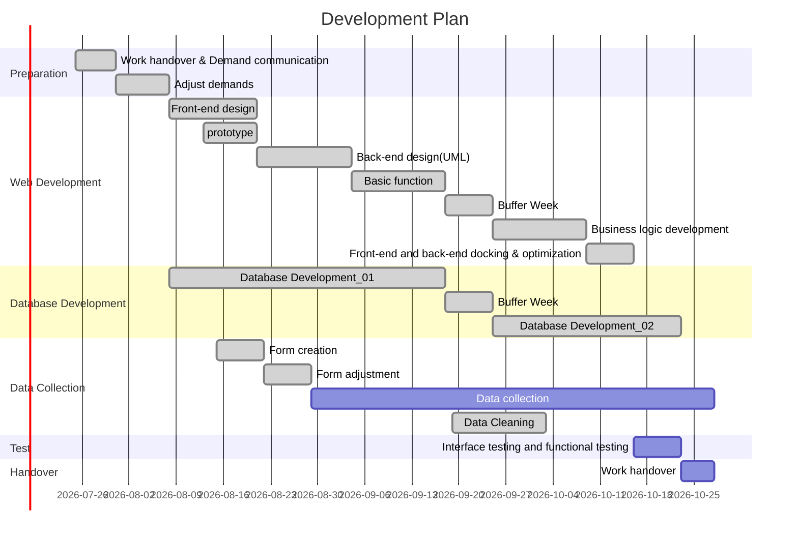

**Inner Intel (Web)**

[]()  [](https://personalisednutrition.github.io) 

---

> Web application for nutritionists

#### 01_Development background

The S.A.Y. team has developed Inner Intel, a Java-based app for Android.
After understanding the needs of nutritionists, the team decided to continue to develop an Inner Intel web-based application that would meet the needs of nutritionists to Contact and guide general users in dietetics.

---

#### 02_Technical selection

1. **System environment**
   - Windows
   - Ubuntu
   - Chrome
   
2. **Main framework**
   - Django
   - Firebase

---

#### 03_Main Features.

- Shared database with the Inner Intel java side serving regular users.
- There is a complete permission management system.
- There is a comprehensive privacy protection policy.

---

#### 04_Main Functions

- Allows visual viewing of user-specific data.
- The java side of the specified user can be set up by nutritionists.
- nutritionists can view the system's analysis of the specified user's data.
- nutritionists can upload data analysis reports from nutritionists.
- Allow nutritionists to log in using their account email.
-  The nutritionist can view the list of users, priorities, appointment dates, new information on the home page. and sorted by the above characteristics.
- The dietitian can view the user's details and select up to four of the automatically generated reports to display graphical data on the user's details page.
- The nutritionist can tag user data and set up reminder pushes.

---


#### 05_Development Plan

> If the Gantt chart doesn't display, please flash the page.



---


#### 06_Routing path

- Index page：

  ```
  inner/login/  
  ```

- client page：

  ```
  inner/client/  
  ```

- message page：

  ```
  inner/message/  
  ```

- setting page：

  ```
  inner/setting/  
  ```

- client_data page：

  ```
  inner/client/data/  
  ```

- client_note page：

  ```
  inner/client/note/  
  ```

- client_profile page：

  ```
  inner/client/profile/  
  ```

- client_appointment page：

  ```
  inner/client/appointment/  
  ```

  ---


#### 07_API

> The API description will be updated in 12 week.

1. login page

| Interface path                           | inner/login/user/                                            |
| ---------------------------------------- | ------------------------------------------------------------ |
| Interface description                    | Users send their user email and password via the form for login verification. |
| Interface type                           | POST                                                         |
| Key_1                                    | email（Transfer of user login email）                        |
| Key_2                                    | pwd （Transfer of user login password）                      |
| Login Success Response                   | index.html Page                                              |
| User email password match error response | login.html   (error_msg = 'Wrong email or password')         |

2. index page

| Interface path        | inner/index/client_cid/                                      |
| --------------------- | ------------------------------------------------------------ |
| Interface description | When clicking on the user's avatar ，send uid of the current user to client page。 |
| Interface type        | GET                                                          |
| Key                   | cid（send id）                                               |
| Success Response      | client.html Page                                             |
| error response        | client.html Page（No user information displayed）            |

---


#### 08_Group S.A.Y. Team Members

| Name        | title                         | Email               |
| ----------- | ----------------------------- | ------------------- |
| Shuyi Chen  | Spokesperson, Project Manager | u7175274@anu.edu.au |
| Yuhao Zhai  | Spokesperson, Project Manager | u7152566@anu.edu.au |
| Xinyue Hu   | Database Manager              | u7151386@anu.edu.au |
| Hengtong Wu | Database Engineer             | u7235221@anu.edu.au |
| Tianqi Tang | Techinical Lead               | u7192230@anu.edu.au |
| Shiyun Zhu  | Web Developer                 | u7041419@anu.edu.au |
| Siyuan He   | Web Developer                 | u7344524@anu.edu.au |

---

#### 09_License

None

---

#### 
